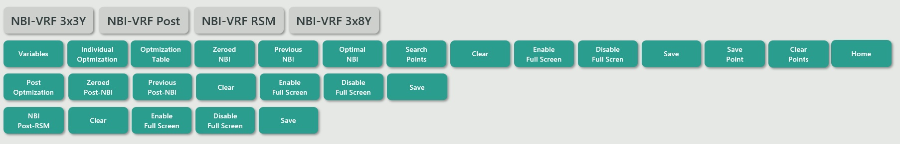
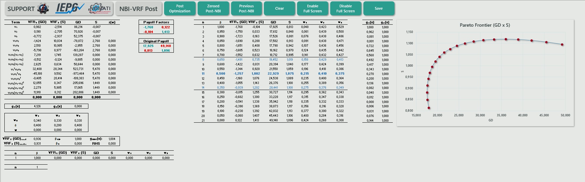

# VRF-NBI: VBA Code

## Description

This VBA code implements the complete process for the **Varimax Rotated Factor Normal Boundary Intersection (VRF-NBI)** method, as described in the papers:
- [A Hybrid Multivariate Normal Boundary Intersection Approach with Post-Optimization Assisted by Mixture Design of Experiments](link);
- [Nonlinear Multiobjective Optimization of Efficiency Conditions using a CFD-DOE Hybrid Approach: A Practical Application in Centrifugal Fans for Industrial Ovens](link);
- [Multiobjective Optimization in Machining Processes with High Dimensionality: An Approach to Post-Pareto Decision Making](link).

The code is designed to be run within Excel and covers everything from individual optimization to the NBI process, including post-optimization routines and additional utilities for formatting.

The main goal is to allow users to execute the VRF-NBI process directly within Excel, utilizing VBA programming for both optimization tasks and visualization.

## How to Use

1. Download or clone this repository to your local machine.
2. Open the Excel file containing the VBA macros.
3. Ensure that macros are enabled in Excel.
4. Run the desired VBA routines directly from the VBA editor or assign them to buttons in your Excel sheets.
5. The code includes detailed comments and auxiliary figures to help you understand its functionality.

## Worksheets Used

- **NBI-VRF 3x3Y**: Multi-objective optimization using VRF-NBI for 3 input variables and 3 output variables.
- **NBI-VRF Post**: Post-optimization using VRF-NBI for Mixture Design, with metrics as output variables.
- **NBI-VRF RSM**: Multi-objective optimization using VRF-NBI to find the "optimal of the optimals."
- **NBI-VRF 3x8Y**: Multi-objective optimization using VRF-NBI for 8 input variables and 8 output variables.

## Figures

Here are some figures related to the Excel sheets used in this project:

1. **NBI-VRF - Buttons**  
     
   *Existing buttons in the NBI-VRF sheet.*

2. **NBI-VRF 3x3Y - Home**  
     
   *Initial screen of the NBI-VRF 3x3Y sheet.*

3. **NBI-VRF 3x3Y - Metrics, Constraints, and VarCovar**  
   .
   *Metrics (NED, GPE, S, S/GPE, MD, and GD), constraints (g1(x), g2(x), g3(x), and g4(x)), payoff matrix of rotated factors, and variance-covariance matrix of rotated factors.*

4. **NBI-VRF 3x3Y - NBI Points**  
     
   *Optimal points generated by the Zeroed NBI method.*

5. **NBI-VRF 3x3Y - Search Points**  
     
   *Search for points using any of the 3 VRF-NBI methods.*

6. **NBI-VRF 3x8Y - Home**  
     
   *Initial screen of the NBI-VRF 3x8Y sheet.*

7. **NBI-VRF Post - Home**  
     
   *Complete initial screen of the NBI-VRF Post sheet.*

8. **NBI-VRF RSM - Home**  
     
   *Complete initial screen of the NBI-VRF RSM sheet.*

## VBA Routines/Buttons

### 1. Variable Creation
- **`Variables`**: Declares and initializes necessary variables.

### 2. Individual Optimization
- **`IndividualOptimization`**: Executes individual optimization routines.
- **`OptimizationTable`**: Generates and manages the optimization table.

### 3. VRF-NBI
- **`ZeroedNBI`**: Executes the NBI process with zeroed initial points.
- **`PreviousNBI`**: Runs the NBI process using previous optimal points.
- **`OptimalNBI`**: Executes the NBI process to find optimal points.
- **`ZeroedPostNBI`**: Runs post-optimization with zeroed points.
- **`PreviousPostNBI`**: Executes post-optimization using previous optimal points.
- **`NBIPostRSM`**: Conducts post-optimization using Response Surface Methodology (RSM).

### 4. Additional Functions
- **`SearchPoints`**: Searches for specific points within the data.
- **`Clear`**: Clears designated cells in the worksheets.
- **`EnableFullScreen`**: Enables full-screen mode for better visualization.
- **`DisableFullScreen`**: Disables full-screen mode.
- **`Save`**: Saves the current workbook.
- **`SavePoint`**: Saves specific points during optimization.
- **`ClearPoints`**: Clears saved points.
- **`Home`**: Navigates back to the main worksheet.

## Contact

If you have any questions or suggestions, feel free to reach out via:

- **Email**: [matheusc_pereira@hotmail.com](mailto:matheusc_pereira@hotmail.com)
- **LinkedIn**: [LinkedIn Profile](https://www.linkedin.com/in/matheuscostapereira/)
- **Lattes**: [Lattes Profile](https://lattes.cnpq.br/7025666927284220)
